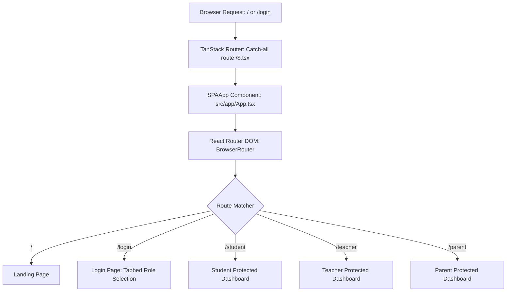

# 🎓 EduTrack (STSV International Portal)

> **A premium, multi-role School Management Web App prototype.**
> Designed for **STSV International Sr. Secondary School** (Dhanupra, Arrah, Bihar).

EduTrack is a highly responsive, multi-role school portal featuring unified authentication and dedicated dashboards for **Teachers**, **Students**, and **Parents**. The project includes interactive quiz authoring, live-countdown timed assessments, student performance analytics (utilizing visual charts), digital report cards, EmailJS reports, and a concern ticketing system.

---


## ✨ System Highlights

- 🧑‍🏫 **Teacher Dashboard** — Create quizzes using a seamless 3-step wizard, review scheduled tests, input grades, view detailed student profiles with notes, export data as CSV, send reports via EmailJS, and resolve raised concerns.
- 🎓 **Student Dashboard** — Features a live count-down to upcoming tests. Students can take full-screen timed quizzes with question flagging and grid navigation. Also includes comprehensive performance review analytics (Line, Bar, and Pie charts), results history, and a concern submission portal.
- 👨‍👩‍👧 **Parent Dashboard** — Overview of child progress, printable HTML report cards, comparative class ranking, teacher remarks, alerts, and direct contact with teachers via EmailJS.
- 🎨 **Visual Aesthetics** — Premium charcoal/copper/linen color palette (`stsv` and `stsvdark` DaisyUI themes), custom GSAP pill navigation animations, and a dynamic WebGL Prism shader background on the landing page.

---

## 🏗️ Architecture & Routing Design

To handle the hybrid setup of the codebase, a **Single Splat Entrypoint** architecture is used:



### Routing Coexistence
The project utilizes a hybrid setup combining **TanStack Start/Router** and **React Router DOM** (`BrowserRouter`):
- **TanStack Router** is configured with a single catch-all splat route (`src/routes/$.tsx`) pointing to `SPAApp`. All routing folders (`src/routes/index.tsx`) have been removed to avoid route-unmounting conflicts.
- **React Router DOM** operates within the single mounted tree of `SPAApp`. This prevents the entire React tree from unmounting on navigation, ensuring state persistence, smooth page transitions, and preventing routing loops.
- `Landing.tsx` handles document title settings dynamically during runtime.

### Persistence
The application uses a prototype-grade local database modeled entirely inside `LocalStorage` (`src/app/lib/storage.ts`). A complete set of school seed data (dummy students, parents, teachers, and quizzes) is automatically loaded on the first startup.

---

## 🛠️ Tech Stack

| Layer | Stack |
| --- | --- |
| **Framework** | React 19 + TanStack Start v1 (Vite 8) |
| **Routing** | React Router DOM v7 + TanStack Router (Catch-all Splat) |
| **State / Data** | React Hooks, Context API, LocalStorage |
| **Styling** | Tailwind CSS v4, DaisyUI v5, Shadcn/UI (Radix primitives) |
| **Animations** | GSAP 3.15 (entrance, pill navigation, count-ups) |
| **Graphics** | OGL (WebGL Prism hero shader) |
| **Charts** | Recharts 3 |
| **Forms** | React Hook Form + Zod |
| **Email API** | EmailJS (`@emailjs/browser`) |
| **Language** | TypeScript 5.8 |

---

## 🚀 Getting Started Locally

### 1. Install Dependencies
Make sure you have [Node.js](https://nodejs.org/) installed, then run:
```bash
npm install
```

### 2. Run the Development Server
Start the local server using Vite:
```bash
npm run dev
```
The application will be available at **[http://localhost:8080](http://localhost:8080)**.

### 3. Build for Production
To generate a static build:
```bash
npm run build
```

---

## 🔑 Demo Accounts

All credentials use the password: `stsv1234`

- **Teacher Login**: `priya@stsv.edu`
- **Student Login**: Roll Number `101`
- **Parent Login**: `suresh@gmail.com` (Requires child roll number `101` during login)

---

## 📤 Pushing to Your GitHub Repository

If you want to push this project to your GitHub repository (**https://github.com/Yes-Mayank/EduTrack.git**), run the following commands sequentially in your project root terminal:

```bash
# 1. Initialize git in the project root directory
git init

# 2. Stage all the files for the initial commit
git add .

# 3. Create the initial commit
git commit -m "initial commit: EduTrack School Management Portal"

# 4. Set the default branch to 'main'
git branch -M main

# 5. Add your remote GitHub repository
git remote add origin https://github.com/Yes-Mayank/EduTrack.git

# 6. Push the codebase to your GitHub main branch
git push -u origin main
```
